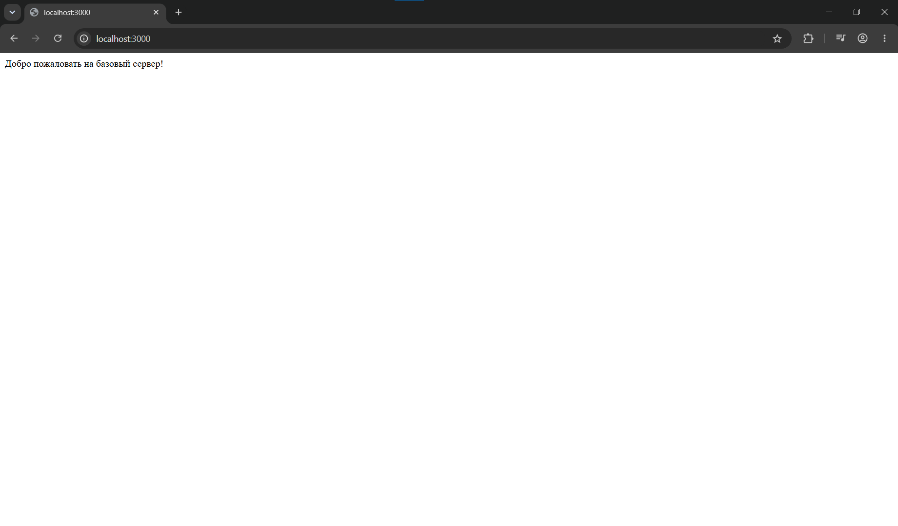
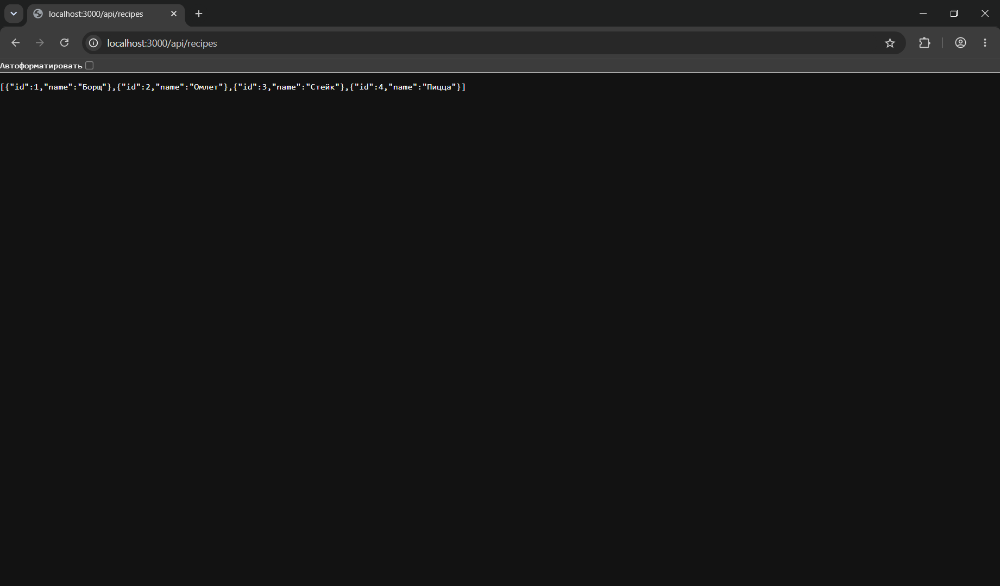
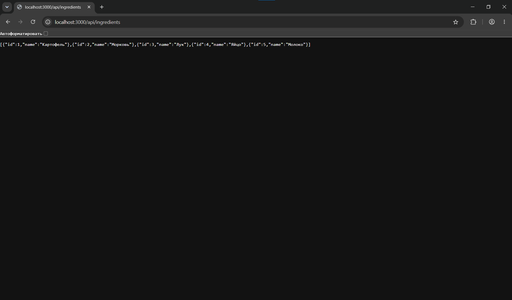
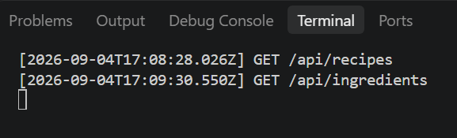
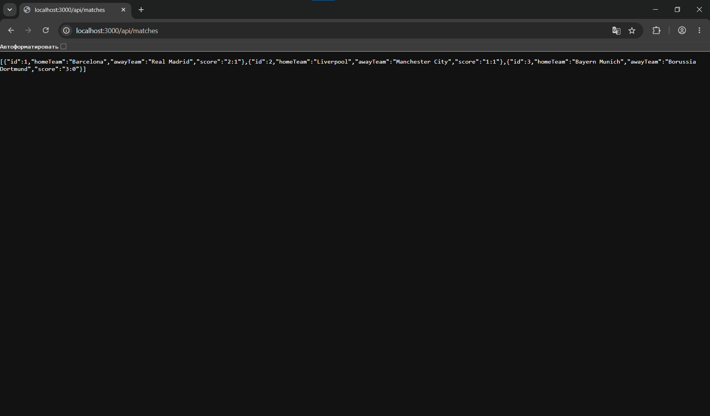
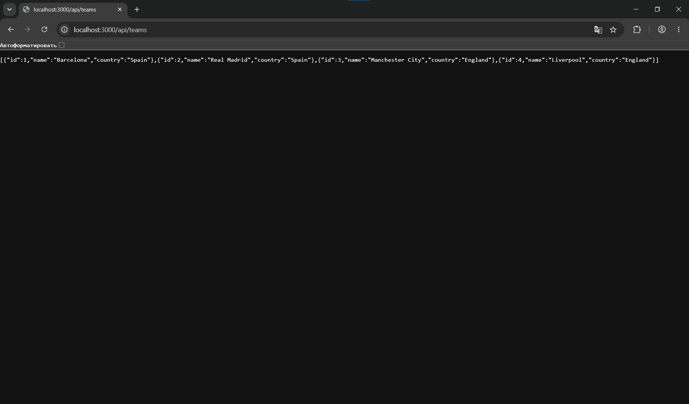
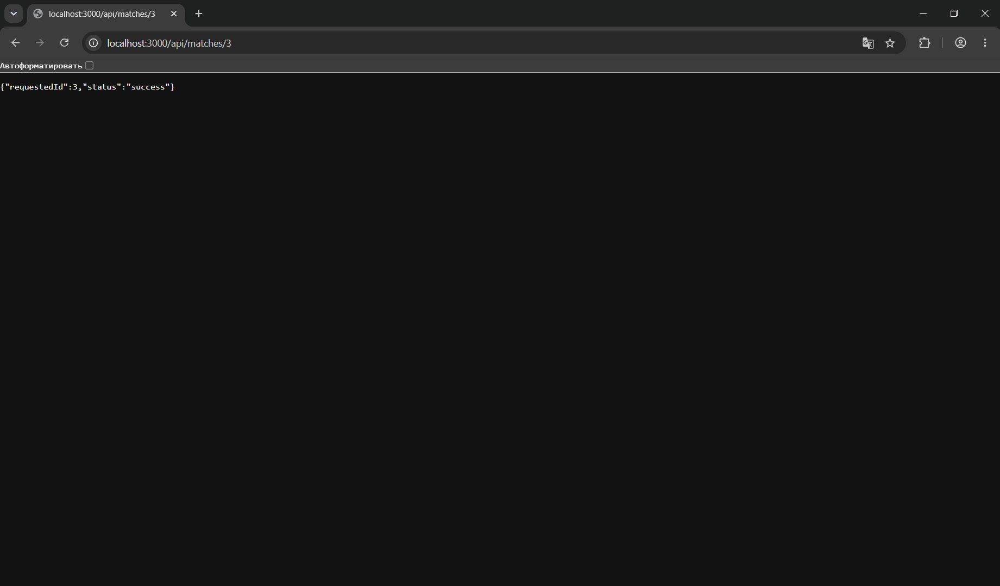

# Лабораторная работа №1: Настройка среды разработки и первый HTTP-сервер
**Студент:** Степанян Даниел Эрнестович
**Группа:** ПИЖ-б-о-25-2
**Вариант:** 12
**Технологии:** Node.js + Express, Python + Flask

## Содержание
- [Лабораторная работа №1: Настройка среды разработки и первый HTTP-сервер](#лабораторная-работа-1-настройка-среды-разработки-и-первый-http-сервер)
  - [Содержание](#содержание)
  - [Цель работы](#цель-работы)
  - [Теоретическое обоснование](#теоретическое-обоснование)
  - [Выполнение практического примера](#выполнение-практического-примера)
    - [Код для JavaScript](#код-для-javascript)
    - [Код на Python](#код-на-python)
    - [Скриншоты](#скриншоты)
  - [Выполнение индивидуального задания](#выполнение-индивидуального-задания)
    - [Индивидуальное задание на JavaScript](#индивидуальное-задание-на-javascript)
      - [Код для индивидуального задания](#код-для-индивидуального-задания)
      - [Описание отдельных элементов кода](#описание-отдельных-элементов-кода)
    - [Индивидуальное задание на Python](#индивидуальное-задание-на-python)
      - [Код для индивидуального задания](#код-для-индивидуального-задания-1)
      - [Описание отдельных элементов кода](#описание-отдельных-элементов-кода-1)
    - [Скриншоты результатов](#скриншоты-результатов)
  - [Ответы на вопросы](#ответы-на-вопросы)
  - [Выводы](#выводы)
  - [Список использованной литературы](#список-использованной-литературы)
  
## Цель работы
Освоить установку инструментов для бэкенд-разработки, создать и запустить минимальный веб-сервер, обрабатывающий GET-запросы, понять концепцию эндпоинтов, научиться настраивать автоматический перезапуск сервера.

## Теоретическое обоснование 
**Бэкенд** (backend) - это серверная часть веб-приложения, которая отвечает за обработку запросов от клиентов, взаимодействие с базами данных, выполнение бизнес-логики и формирование ответов. Бэкенд работает на сервере и не виден пользователю напрямую.
В веб-разработке взаимодействие строится по модели «клиент-сервер».
- **Клиент** (браузер, мобильное приложение) отправляет HTTP-запрос.
- **Сервер** (бэкенд-приложение) принимает запрос, обрабатывает его и отправляет HTTP-ответ.

**Эндпоинт** (endpoint) - это конкретный адрес (URL) вместе с методом HTTP, по которому клиент обращается к серверу для получения ресурса.
**Маршрут** (route) - это механизм сопоставления пути запроса с кодом обработчика на стороне сервера.
**HTTP** - основной протокол передачи данных в интернете. В данной работе мы сосредоточимся на методе **GET**. Он используется исключительно для запроса/получения данных от сервера и не должен изменять состояние сервера (свойство идемпотентности).

Существуют различные стеки технологий, позволяющие реализовывать логику работы серверов. В рамках данной работы будут использованы два.
- **Node.js + Express**: самый популярный инструмент на JS, упрощает переход между фронтендом и бэкендом.
 >**Node.js** - это программная платформа, которая позволяет запускать код на JavaScript не только в браузере, но и на сервере. **Express** - это минималистичный веб-фреймворк для Node.js, который помогает создавать серверные приложения (бэкенд) и API. Он упрощает обработку HTTP-запросов, маршрутизацию, работу с middleware и формирование ответов.
- **Python + Flask**: ещё один популярный стек технологий, облегчающий работу по созданию логики бэкенда.
 >**Flask** - это лёгкий веб-фреймворк для Python, который позволяет создавать серверные приложения (бэкенд) и API. Он упрощает обработку HTTP-запросов, маршрутизацию, работу с шаблонами и формирование ответов. Flask предоставляет базовые инструменты для разработки веб-приложений, оставляя разработчику свободу в выборе дополнительных библиотек и архитектуры проекта.

## Выполнение практического примера
### Код для JavaScript
``` js
const express = require('express');
const app = express();
const port = 3000;

// Консольное логирование каждого запроса (для продвинутого уровня)
app.use((req, res, next) => {
    console.log(`[${new Date().toISOString()}] ${req.method} ${req.url}`);
    next();
});

// 1. Текстовый эндпоинт
app.get('/', (req, res) => {
    res.send('Добро пожаловать на базовый сервер!');
});

// 2. JSON эндпоинт 1
app.get('/api/status', (req, res) => {
    res.json({ status: 'ok', uptime: process.uptime() });
});

// 3. JSON эндпоинт 2 (для среднего уровня)
app.get('/api/info', (req, res) => {
    res.json({ author: 'Student', version: '1.0.0' });
});

// 4. JSON эндпоинт с параметром (для продвинутого уровня)
app.get('/api/users/:id', (req, res) => {
    res.json({
        message: 'Информация о пользователе',
        userId: req.params.id
});
});

// Обработка 404 (для среднего и продвинутого уровня)
app.use((req, res) => {
    res.status(404).json({ error: 'Маршрут не найден' });
});

app.listen(port, () => {
    console.log(`Сервер запущен на http://localhost:${port}`);
});
```

### Код на Python
``` py
from flask import Flask, jsonify, request
import time

app = Flask(__name__)

# Консольное логирование запроса (для продвинутого уровня)
@app.before_request
def log_request():
    print(f"[{time.strftime('%Y-%m-%d %H:%M:%S')}] {request.method} {request.path}")

# 1. Текстовый эндпоинт
@app.route('/')
def home():
    return 'Добро пожаловать на базовый сервер!'

# 2. JSON эндпоинт 1
@app.route('/api/status')
def status():
    return jsonify({"status": "ok", "framework": "Flask"})

# 3. JSON эндпоинт 2 (для среднего уровня)
@app.route('/api/info')
def info():
    return jsonify({"author": "Student", "version": "1.0.0"})

# 4. JSON эндпоинт с параметром (для продвинутого уровня)
@app.route('/api/users/<int:user_id>')
def get_user(user_id):
    return jsonify({"message": "Информация о пользователе", "userId": user_id})

# Обработка 404
@app.errorhandler(404)
def not_found(error):
    return jsonify({"error": "Маршрут не найден"}), 404

if __name__ == '__main__':
    app.run(port=3000, debug=True)
```
### Скриншоты

*Корневой маршрут в практическом задании* 
___

*Пример подходящего JSON-ответа в практическом задании*
___

*Пример неподходящего JSON-ответа в практическом задании*
___

## Выполнение индивидуального задания 
В рамках индивидуального задания предполагается три уровня выполнения задания: базовый, средний и продвинутый. 
- В соответствии с базовым уровнем надо создать 2 эндпоинта (1 текстовый на корневом маршруте / и 1 JSON) и настроить автоматический перезапуск с помощью специального JSON-параметра 'nodemon'. 
- В соответствии со средним уровнем нужно создать 3 эндпоинта (1 текстовый на корневом маршруте / и 2 JSON-списка), настроить автоматический перезапуск, а также добавить кастомную обработку ошибки 404 (Not Found) в JSON-формате.
- В соответствии с продвинутым уровнем требуется создать 5 эндпоинтов: 1 текстовый, 2 простых JSON-эндпоинта, 1 JSON-эндпоинт с параметром в пути, 1 обработчик 404. Также необходимо реализовать автоматический перезапуск и простое консольное логирование всех входящих запросов (метод + URL + время).

### Индивидуальное задание на JavaScript
#### Код для индивидуального задания 
Код для всех трёх уровней на JavaScript представлен ниже.
``` js
const express = require('express');
const app = express();
const port = 3000;

// Консольное логирование каждого запроса (для продвинутого уровня)
app.use((req, res, next) => {                                                   
    console.log(`[${new Date().toISOString()}] ${req.method} ${req.url}`);      
    next();                                                                                                                                                                                                            
});

// 1. Текстовый эндпоинт
app.get('/', (req, res) => {
    res.send('Welcome to my API');
});

// 2. JSON-эндпоинт 1 (для базового уровня)
app.get('/api/docs', (req, res) => {
    res.json(
        { 
            docs_url: '/api/docs', 
            version: 'v1' 
        }
    );
});

// 3. JSON-эндпоинт 2 (для среднего уровня)
app.get('/api/recipes', (req, res) => {
    res.json([
        {
            id: 1,
            name: 'Борщ',
        },
        {
            id: 2,
            name: 'Омлет',
        },
        {
            id: 3,
            name: 'Стейк',
        },
        {
            id: 4,
            name: 'Пицца'
        }
    ]);
});

// 4. JSON-эндпоинт 3 (для среднего уровня)
app.get('/api/ingredients', (req, res) => {
    res.json([
        {
            id: 1,
            name: 'Картофель',
        },
        {
            id: 2,
            name: 'Морковь',
        },
        {
            id: 3,
            name: 'Лук',
        },
        {
            id: 4,
            name: 'Яйцо',
        },
        {
            id: 5,
            name: 'Молоко',
        }
    ]);
});

// Массив данных для функций (для продвинутого уровня)
const matches = [
    {
        id: 1,
        homeTeam: 'Barcelona',
        awayTeam: 'Real Madrid',
        score: '2:1'
    },
    {
        id: 2,
        homeTeam: 'Liverpool',
        awayTeam: 'Manchester City',
        score: '1:1'
    },
    {
        id: 3,
        homeTeam: 'Bayern Munich',
        awayTeam: 'Borussia Dortmund',
        score: '3:0'
    }
];

// 5. JSON-эндпоинт 4 (для продвинутого уровня)
app.get('/api/matches', (req, res) => {
    res.json(matches);
});

// 6. JSON-эндпоинт 5 (для продвинутого уровня)
app.get('/api/teams', (req, res) => {
    res.json([
        {
            id: 1,
            name: 'Barcelona',
            country: 'Spain'
        },
        {
            id: 2,
            name: 'Real Madrid',
            country: 'Spain'
        },
        {
            id: 3,
            name: 'Manchester City',
            country: 'England'
        },
        {
            id: 4,
            name: 'Liverpool',
            country: 'England'
        }
    ]);
});

// 7. Эндпоинт с параметром (для продвинутого уровня)
app.get('/api/matches/:id', (req, res) => {
    const requestedId = Number(req.params.id);                          

    const match = matches.find(match => match.id === requestedId);

    if (match) {
        res.json(
            {
                requestedId: requestedId,
                status: 'success'
            }
        );
    } else {
        res.status(404).json(
            {
                requestedId: requestedId,
                status: 'error'
            }
        );
    }
});

// Обработка 404 (для среднего и продвинутого уровня)
app.use((req, res) => {
    res.status(404).json({ error: 'Not Found' });
});

app.listen(port, () => {
    console.log(`Сервер запущен на http://localhost:${port}`);
});
```

#### Описание отдельных элементов кода
`app.use(...)`
- `app.use()` - это метод Express, который регистрирует middleware-функцию (промежуточную). В отличие от `app.get()` или `app.post()`, которые привязаны к конкретному HTTP-методу, ``app.use()` без указания пути срабатывает на каждый запрос, независимо от метода (GET, POST, PUT и т.д.) и URL.

`(req, res, next) => { ... }` - функция-обработчик
- `req` (request) - объект запроса. Содержит всю информацию о входящем HTTP-запросе: URL, метод, заголовки, тело запроса, параметры и т.д.
- `res` (response) - объект ответа. Через него формируется и отправляется ответ клиенту (`res.send()`, `res.json()` и т.п.). В этом конкретном middleware он не используется, но обязателен как параметр.
- `next` - функция, которая передаёт управление следующему middleware в цепочке. Без её вызова запрос "зависнет" - Express не пойдёт дальше, и клиент не получит ответ.

`const requestedId = Number(req.params.id)`
- `req.params` - объект, куда Express кладёт все именованные параметры из URL (те, что после двоеточия в пути). Для маршрута `/api/matches/:id в req.params` будет `{ id: '5' }`.
- `req.params.id` - получение значения параметра id.
- `Number(...)` - преобразование строки в число. `req.params.id` всегда приходит как строка, даже если в URL были только цифры.

`const match = matches.find(match => match.id === requestedId)`
- `matches` - массив объектов, каждый из которых представляет собой матч/игру с полем id.
- `.find(...)` - встроенный метод массивов, который проходит по каждому элементу массива и возвращает первый элемент, для которого функция-предикат вернула true. Если ничего не найдено, возвращает undefined.
- `match => match.id === requestedId` - сама функция-предикат. Для каждого элемента массива match (имя переменной внутри find совпадает с именем внешней константы match).
- `===` - строгое сравнение: сравнивается и значение, и тип. Именно поэтому важно было привести requestedId к числу: если бы `match.id` в массиве был числом, а requestedId остался строкой, сравнение никогда бы не сработало.

Автоматическое обновление сервера при изменении кода происходит благодаря установке через npm `nodemon` и последующей записи `"dev": "nodemon app.js"` в scripts и `"nodemon": "^3.1.14"` в devDepedencies в package.json. 

### Индивидуальное задание на Python
#### Код для индивидуального задания
Код для всех трёх уровней на Python представлен ниже.
``` py
from flask import Flask, jsonify, request
import time

app = Flask(__name__)

# Консольное логирование запроса (для продвинутого уровня)
@app.before_request
def log_request():
    print(f"[{time.strftime('%Y-%m-%d %H:%M:%S')}] {request.method} {request.path}")

# 1. Текстовый эндпоинт
@app.route('/')
def home():
    return 'Welcome to my API'

# 2. JSON-эндпоинт 1 (для базового уровня)
@app.route('/api/docs')
def docs():
    return jsonify(
        {
            "docs_url": "/api/docs", 
            "version": "v1"
        }
    )

# 3. JSON-эндпоинт 2 (для среднего уровня)
@app.route('/api/recipes')
def recipes():
    return jsonify([
        {
            "id": "1",
            "name": "Борщ",
        },
        {
            "id": "2",
            "name": "Омлет",
        },
        {
            "id": "3",
            "name": "Стейк",
        },
        {
            "id": "4",
            "name": "Пицца"
        }
    ])

# 4. JSON-эндпоинт 3 (для среднего уровня)
@app.route('/api/ingredients')
def ingredients():
    return jsonify([
        {
            "id": "1",
            "name": "Картофель",
        },
        {
            "id": "2",
            "name": "Морковь",
        },
        {
            "id": "3",
            "name": "Лук",
        },
        {
            "id": "4",
            "name": "Яйцо",
        },
        {
            "id": "5",
            "name": "Молоко",
        }
    ])

# Массив данных для функций (для продвинутого уровня)
matches_list = [
    {
        "id": 1,
        "homeTeam": "Barcelona",
        "awayTeam": "Real Madrid",
        "score": "2:1"
    },
    {
        "id": 2,
        "homeTeam": "Liverpool",
        "awayTeam": "Manchester City",
        "score": "1:1"
    },
    {
        "id": 3,
        "homeTeam": "Bayern Munich",
        "awayTeam": "Borussia Dortmund",
        "score": "3:0"
    }
]

# 5. JSON-эндпоинт 4 (для продвинутого уровня)
@app.route('/api/matches')
def matches():
    return jsonify(matches_list)

# 6. JSON-эндпоинт 5 (для продвинутого уровня)
def teams():
    return jsonify([
        {
            "id": "1",
            "name": "Barcelona",
            "country": "Spain"
        },
        {
            "id": "2",
            "name": "Real Madrid",
            "country": "Spain"
        },
        {
            "id": "3",
            "name": "Manchester City",
            "country": "England"
        },
        {
            "id": "4",
            "name": "Liverpool",
            "country": "England"
        }
    ])

# 7. Эндпоинт с параметром (для продвинутого уровня)
@app.route('/api/matches/<int:match_id>')
def get_match(match_id):                                # Прояснить функцию
    match = next((m for m in matches_list if m["id"] == match_id), None)
    
    if match is None:
        return jsonify({"error": f"Матч с id {match_id} не найден"}), 404
    
    return jsonify(match)

# Обработка 404
@app.errorhandler(404)
def not_found(error):
    return jsonify({"error": "Not Found"}), 404

if __name__ == '__main__':                               # Прояснить
    app.run(port=3000, debug=True)
```

#### Описание отдельных элементов кода
`if __name__ == '__main__': `
- Каждому Python-файлу (модулю) при выполнении присваивается специальная переменная `__name__`. Если файл запущен напрямую (например, командой `python app.py`), то `__name__` автоматически становится равен строке `"__main__"`.
- Условие проверяет, равно ли текущее значение `__name__` строке `'__main__'`. Если условие выполняется, то файл запущен напрямую, и тогда выполняется app.run(...), то есть запускается сервер.

`@app.route('/api/matches/<int:match_id>'`
- `int:match_id` - Flask сам преобразует часть URL в int и передаёт как аргумент функции. Если в URL будет не число, Flask вернёт стандартную 404-ошибку ещё до входа в функцию.

`next((m for m in matches_data if m["id"] == match_id), None)` - генератор, который ищет в списке первый матч с нужным id.
- `next()` берёт первый подходящий элемент.
- `None` - это значение по умолчанию, если ничего не найдено. Если `match is None`, то матча с данным id нет в данных - возвращается 404.
- Если совпадение найдено, возвращается сам объект матча.

Автоматическое обновление сервера при изменении кода происходит благодаря флагу debug=True в app.run, означающий режим отладки.

### Скриншоты результатов

*Корневой маршрут*


*Эндпоинт docs*


*Ошибка 404*


*Эндпоинт recipes*


*Эндпоинт ingredients*


*Логирование состояния сервера*


*Эндпоинт matches*


*Эндпоинт teams*


*Эндпоинт matches с параметром*'

## Ответы на вопросы
1. Что такое клиент-серверная архитектура? 
**Ответ**: это модель организации сети, где задачи и обязанности разделены между двумя главными участниками: клиентом (который запрашивает услугу или данные) и сервером (который эти данные обрабатывает и предоставляет). 
2. Какой протокол используется для общения клиента и сервера в вебе? 
**Ответ**: HTTP.
3. Что такое эндпоинт (endpoint)? 
**Ответ**: это конкретный адрес (URL) вместе с методом HTTP, по которому клиент обращается к серверу для получения ресурса. Например: GET /api/users. 
4. Какую структуру имеет HTTP-запрос и HTTP-ответ? Что такое код состояния (status code)? 
**Ответ**: HTTP-запрос обычно состоит из метода HTTP, URL/пути, заголовков (headers), тела (body) (присутствует, например, при отправке JSON).
HTTP-ответ состоит кода состояния заголовков, тела ответа.
Код состояния - числовой код, который сообщает клиенту результат обработки запроса в виде числа.
5. Что такое JSON? Почему он популярен в веб-разработке? 
**Ответ**: JSON (JavaScript Object Notation) - это текстовый формат для хранения и передачи структурированных данных.
JSON популярен потому, что его легко читать человеку, его легко обрабатывать программам, он компактный, поддерживается практически всеми языками программирования.
6. Как запустить сервер на Node.js или Flask? 
**Ответ**: на Node.js это делается с помощью применения фреймворка Express, написания соответствующего кода и ввода в терминале npm run dev, на Flask через ввод python app.py.
7. Что такое автоматический перезапуск сервера и зачем он нужен? Какой пакет используется для Node.js? 
**Ответ**: автоматический перезапуск означает, что сервер самостоятельно перезапускается после изменения исходного кода. Это удобно во время разработки: не нужно каждый раз вручную останавливать и запускать сервер.
Для Node.js часто используется пакет nodemon.
8. Какие коды состояния HTTP вы знаете? За что отвечает код 404? 
**Ответ**: коды HTTP делятся на информационные (1xx), успешного выполнения (2xx), перенаправления (3xx), ошибки со стороны клиента (4xx), ошибки сервера (5xx).
Наиболее распространённые:
- 200 OK - запрос успешно выполнен.
- 201 Created - ресурс успешно создан.
- 204 No Content - запрос выполнен, но тело ответа отсутствует.
- 400 Bad Request - некорректный запрос.
- 401 Unauthorized - пользователь не авторизован.
- 403 Forbidden - доступ запрещён.
- 404 Not Found - ресурс не найден.
- 500 Internal Server Error - внутренняя ошибка сервера.
9. Что такое middleware в Express / декораторы запросов во Flask?
**Ответ**: Middleware в Express - это функция, которая выполняется между получением запроса и отправкой окончательного ответа. Middleware-функции могут, например, логировать запросы и проверять авторизацию.
Во Flask похожую роль выполняют декораторы (@app.route(), @app.before_request).
10. Как получить параметр из URL-пути (например, ID пользователя) в фреймворке? э
**Ответ**: в Express параметр указывается через : (`app.get("/users/:id", (req, res) => {`), во Flask таким образом: `@app.route("/users/<int:id>")`.

## Выводы
В результате выполнения работы был получен базовый теоретический материал, связанный с бэкенд-разработкой, и освоены первичные навыки создания веб-серверов, обрабатывающих GET-запросы, с помощью стеков технологий Python + Flask и Node.js + Express, в том числе их автоматический перезапуск.

## Список использованной литературы
1. **Node.js официальная документация** — https://nodejs.org/en/docs/ 
2. **Express официальная документация** — https://expressjs.com/ 
3. **Flask официальная документация** — https://flask.palletsprojects.com/ 
4. **HTTP протокол (MDN)** — https://developer.mozilla.org/ru/docs/Web/HTTP 
5. **JSON (MDN)** — 
https://developer.mozilla.org/ru/docs/Web/JavaScript/Reference/Global_Objects/JS
ON 
6. **Nodemon документация** — https://nodemon.io/ 
7. **Postman документация** — https://learning.postman.com/docs/getting
started/introduction/ 
8. **REST API — основные принципы (GeeksforGeeks)** — 
https://www.geeksforgeeks.org/node-js/explain-the-concept-of-restful-apis-in
express 