# Лабораторная работа №12:  HTTP-методы: обработка GET, POST, PUT, DELETE 
**Студент:** Степанян Даниел Эрнестович
**Группа:** ПИЖ-б-о-25-2
**Вариант:** 12
**Технологии:** Node.js + Express, Postman

## Содержание
- [Лабораторная работа №12:  HTTP-методы: обработка GET, POST, PUT, DELETE](#лабораторная-работа-12--http-методы-обработка-get-post-put-delete)
  - [Содержание](#содержание)
  - [Цель работы](#цель-работы)
  - [Теоретическое обоснование](#теоретическое-обоснование)
  - [Выполнение практического примера и создание коллекции Postman](#выполнение-практического-примера-и-создание-коллекции-postman)
    - [Код для JavaScript](#код-для-javascript)
    - [Скриншоты](#скриншоты)
  - [Выполнение индивидуального задания](#выполнение-индивидуального-задания)
    - [Код для индивидуального задания](#код-для-индивидуального-задания)
    - [Скриншоты результатов](#скриншоты-результатов)
  - [Ответы на вопросы](#ответы-на-вопросы)
    - [Базовый уровень](#базовый-уровень)
    - [Средний уровень](#средний-уровень)
    - [Продвинутый уровень](#продвинутый-уровень)
  - [Выводы](#выводы)
  - [Список использованной литературы](#список-использованной-литературы)
  
## Цель работы
Освоить обработку различных HTTP-методов (GET, POST, PUT, DELETE) в Express. Научиться реализовывать CRUD операции над коллекцией объектов, хранящейся в памяти сервера, а также возвращать корректные HTTP-коды ответов (200, 201, 404).

## Теоретическое обоснование 
**CRUD** - CRUD - это акроним, обозначающий четыре базовые операции над данными: Create, Read, Update, Delete. В HTTP им соответствуют методы POST, GET, PUT/PATCH, DELETE.

**GET** - HTTP-метод, предназначенный для получения данных с сервера. Тело запроса отсутствует. Коды ответов: 200 OK, 400 Not Found.
**POST** - HTTP-метод, предназначенный для создания нового ресурса. Тело запроса содержит данные нового ресурса. Коды ответов: 201 Created, 404 Not Found.
**PUT** - HTTP-метод, предназначенный для полной замены существующего метода. Тело запроса содержит нужные данные ресурса. Коды ответов: 200 OK, 404 Not Found.
**DELETE** - HTTP-метод, предназначенный для удаления ресурса. Тело запроса отсутствует. Коды ответов: 200 OK, 204 No Content, 404 Not Found.

## Выполнение практического примера и создание коллекции Postman
### Код для JavaScript
``` js
const express = require('express'); 
const app = express(); 
const port = 3000; 
 
// Middleware для парсинга JSON из тела запроса 
app.use(express.json()); 
 
// Middleware для логирования запросов 
app.use((req, res, next) => { 
    console.log(`[${new Date().toISOString()}] ${req.method} ${req.url}`); 
    next(); 
}); 
 
// ============ ХРАНИЛИЩЕ ДАННЫХ В ПАМЯТИ ============ 
let items = [ 
    { id: 1, name: 'Товар 1', price: 100, quantity: 5 }, 
    { id: 2, name: 'Товар 2', price: 200, quantity: 3 }, 
    { id: 3, name: 'Товар 3', price: 300, quantity: 10 } 
]; 
 
// Счётчик для генерации новых ID 
let nextId = 4; 
 
// ============ CRUD-ОПЕРАЦИИ ============ 
 
// GET /items — получить все элементы 
app.get('/items', (req, res) => { 
    res.json({ 
        count: items.length, 
        items: items 
    }); 
}); 
 
// GET /items/:id — получить один элемент 
app.get('/items/:id', (req, res) => { 
    const id = parseInt(req.params.id); 
    const item = items.find(i => i.id === id); 
     
    if (!item) { 
        return res.status(404).json({ error: 'Элемент не найден' }); 
    } 
     
    res.json(item); 
}); 
 
// POST /items — создать новый элемент 
app.post('/items', (req, res) => { 
    const { name, price, quantity } = req.body; 
     
    // Валидация: обязательные поля 
    if (!name || price === undefined) { 
        return res.status(400).json({  
            error: 'Поля name и price обязательны'  
        }); 
    } 
     
    // Создаём новый элемент 
    const newItem = { 
        id: nextId++, 
        name: name, 
        price: price, 
        quantity: quantity || 0 
    }; 
     
    items.push(newItem); 
     
    // 201 Created — ресурс создан 
    res.status(201).json(newItem); 
}); 
 
// PUT /items/:id — обновить элемент 
app.put('/items/:id', (req, res) => { 
    const id = parseInt(req.params.id); 
    const index = items.findIndex(i => i.id === id); 
     
    if (index === -1) { 
        return res.status(404).json({ error: 'Элемент не найден' }); 
    } 
     
    const { name, price, quantity } = req.body; 
     
    // Полное обновление 
    items[index] = { 
        id: id, 
        name: name || items[index].name, 
        price: price !== undefined ? price : items[index].price, 
        quantity: quantity !== undefined ? quantity : items[index].quantity 
    }; 
     
    res.json(items[index]); 
}); 
 
// DELETE /items/:id — удалить элемент 
app.delete('/items/:id', (req, res) => { 
    const id = parseInt(req.params.id); 
    const index = items.findIndex(i => i.id === id); 
     
    if (index === -1) { 
        return res.status(404).json({ error: 'Элемент не найден' }); 
    } 
     
    const deletedItem = items.splice(index, 1)[0]; 
     
    // 200 OK с удалённым элементом 
    res.json({ 
        message: 'Элемент удалён', 
        deleted: deletedItem 
    }); 
}); 
 
// ============ ОБРАБОТКА 404 ============ 
app.use((req, res) => { 
    res.status(404).json({ error: 'Маршрут не найден' }); 
}); 
 
// ============ ЗАПУСК СЕРВЕРА ============ 
app.listen(port, () => { 
    console.log(`Сервер запущен на http://localhost:${port}`); 
}); 
```

### Скриншоты
Проверка методов была осуществлена с помощью Postman.

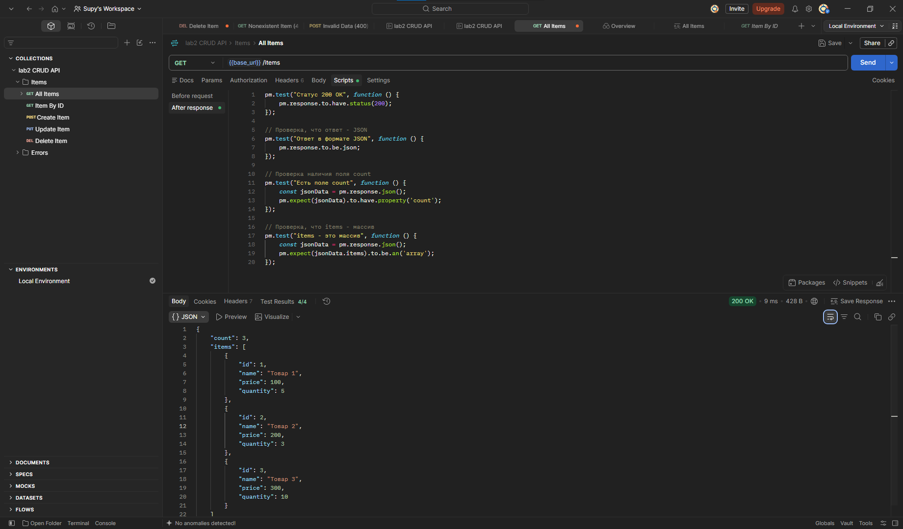
*Получение всех данных методом GET* 
___
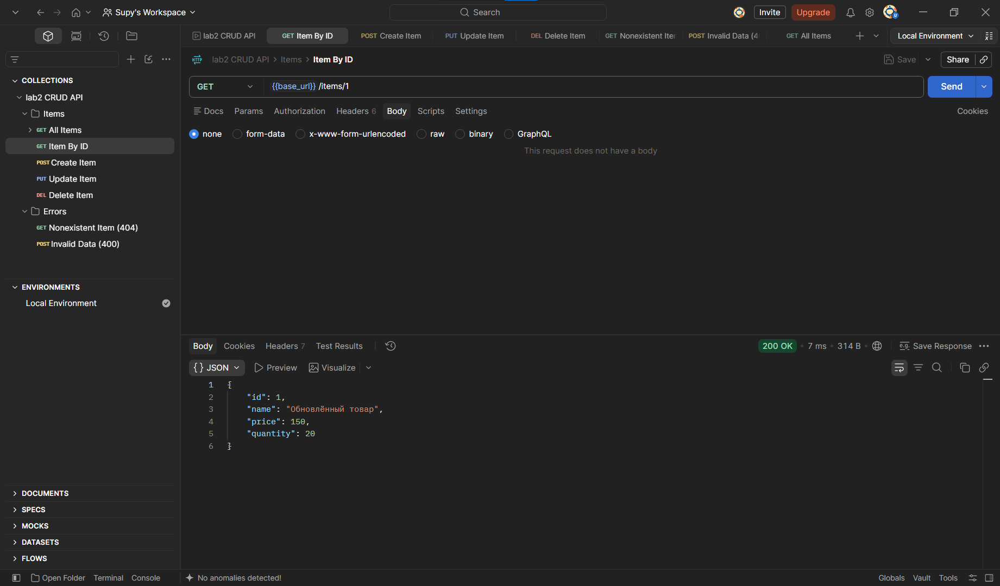
*Получение одного элемента методом GET* 
___
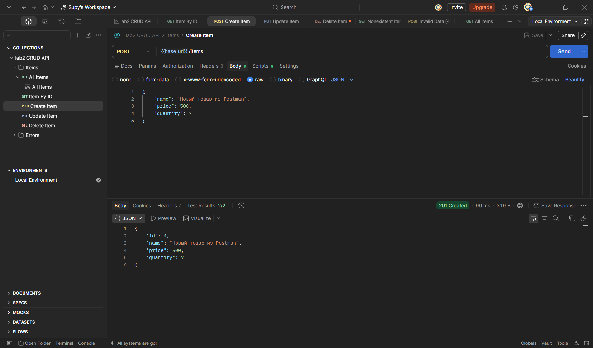
*Создание нового элемента методом POST* 
___
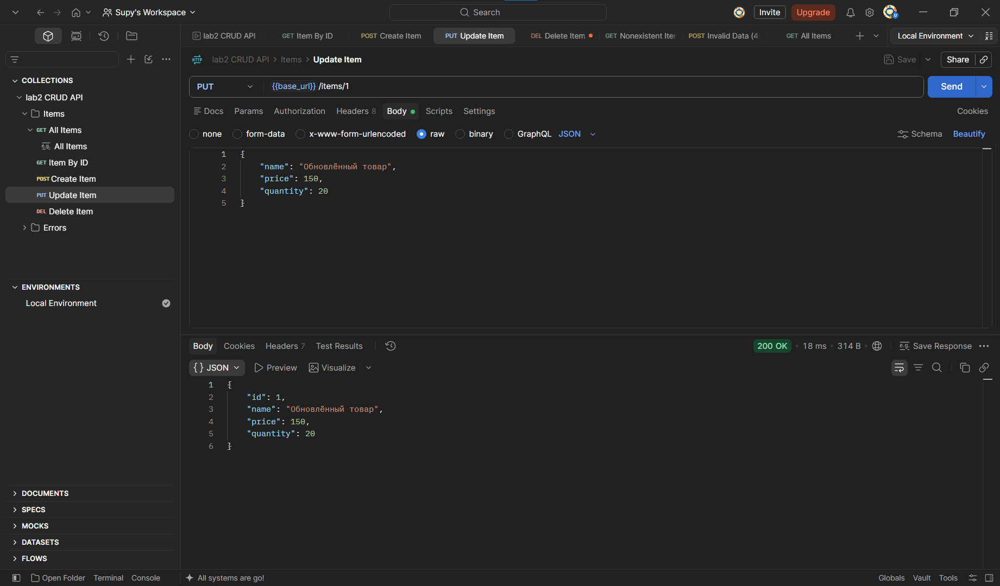
*Изменение существующего элемента методом PUT* 
___
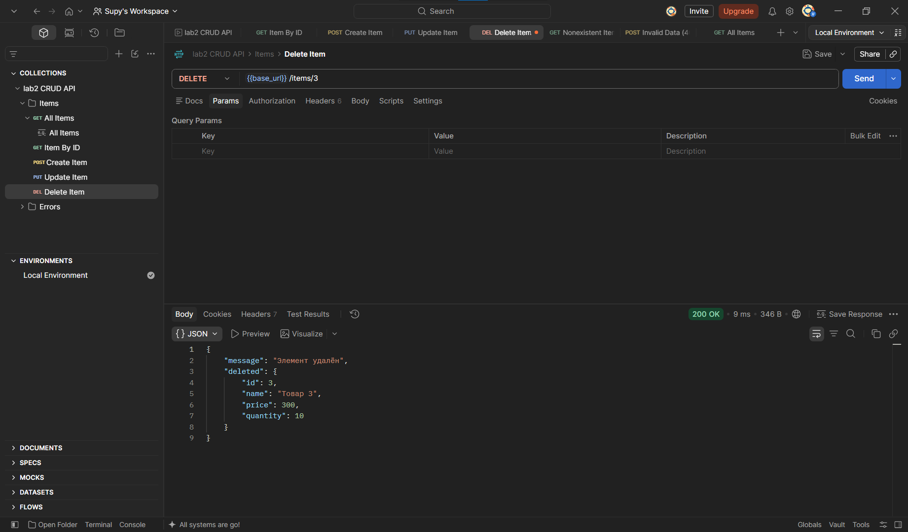
*Удаление элемента методом DELETE* 
___
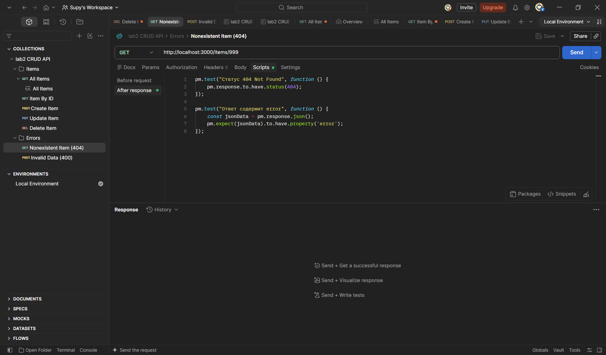
*Вызов GET с несуществующим параметром (для тестов)* 
___
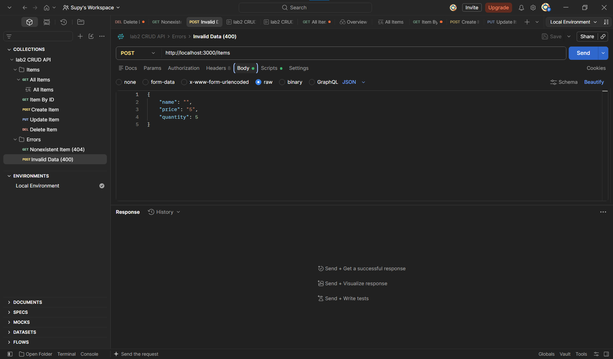
*Вызов POST с недопустимым телом запроса (для тестов)* 
___
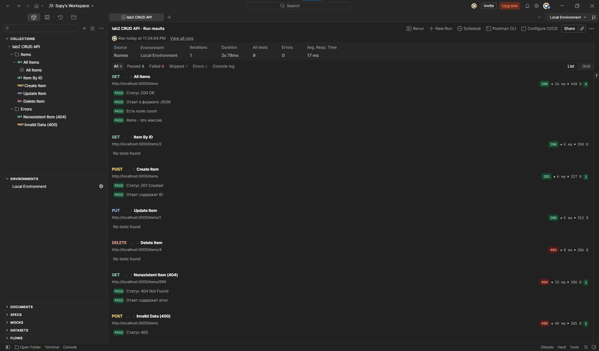
*Результаты всех тестов* 
___

## Выполнение индивидуального задания 
В рамках индивидуального задания предполагается три уровня выполнения задания: базовый, средний и продвинутый. 
- В соответствии с базовым уровнем необходимо реализовать следующие эндпоинты для массива games с полями id, title, genre: 
    - GET /games - список всех элементов;
    - GET /games/:id - один элемент;
    - POST /games - создание;
    - PUT /games/:id - обновление;
    - DELETE /games/:id - удаление;
Также нужно добавить обработку ошибки 404 при отсутствии элемента.
- В соответствии со средним уровнем нужно реализовать:
    - всё из базового уровня; 
    - поля platform и rating;
    - проверку обязательных полей (400 Bad Request);
    - проверку типов (например, price - число); 
    - проверку допустимых значений; 
    - дополнительные эндпоинты: GET /games?search=... - поиск по названию (title); GET /games?sort=field&order=asc|desc - сортировка; GET /games?page=1&limit=10 - пагинация.
    - правильные коды ответов: 201 Created при POST, 204 No Content при DELETE (без тела ответа), 400 Bad Request при неверных данных. 
- В соответствии с продвинутым уровнем нужно реализовать:
    - всё из среднего уровня;
    - обновление передаваемых полей через PATCH /games/:id;
    - удаление всех элементов через DELETE /games;
    - добавление нескольких элементов с помощью POST /games/bulk;
    - GET /games/stats (количество и средний рейтинг);
    - GET /games/id/related (элементы, связанные по платформе);
    - глобальный обработчик ошибок 500.

### Код для индивидуального задания 
Код для всех трёх уровней на JavaScript представлен ниже.
``` js
const express = require('express');
const app = express();
const port = 3000;

// Middleware для парсинга JSON из тела запроса
app.use(express.json());

// Middleware для логирования запросов
app.use((req, res, next) => {
    console.log(`[${new Date().toISOString()}] ${req.method} ${req.url}`);
    next();
});

// Хранилище данных в памяти (поля platform и rating для среднего уровня)
let games = [
    { id: 1, title: 'Dark Souls', genre: 'action-RPG', platform: 'PC, PlayStation 3', rating: 8.5 },
    { id: 2, title: 'Warcraft 3', genre: 'RTS', platform: 'PC', rating: 9.1 },
    { id: 3, title: 'Call of Duty 4', genre: 'shooter', platform: 'PC, PlayStation 3, XBOX 360', rating: 9.2 }
];

// Счётчик для генерации новых ID
let nextId = games.length;

// Настройки и вспомогательные функции для GET /games (средний и продвинутый уровень)
 
const ALLOWED_SORT_FIELDS = ['id', 'title', 'genre', 'platform', 'rating'];     // список полей, по которым разрешена сортировка
const DEFAULT_PAGE = 1;                                                         // доля выводимого списка по умолчанию (1:1)
const DEFAULT_LIMIT = 10;                                                       // предел элементов на одну страницу (долю) по умолчанию
const MAX_LIMIT = 100;
const MAX_BULK = 100;                                                           // максимальное количество добавляемых элементов за раз

// Проверка полей для PATCH (продвинутый уровень)
const FIELD_VALIDATORS = {
    title:    { check: v => typeof v === 'string' && v.trim() !== '',      message: 'title должен быть непустой строкой' },
    genre:    { check: v => typeof v === 'string',                         message: 'genre должен быть строкой' },
    platform: { check: v => typeof v === 'string',                         message: 'platform должен быть строкой' },
    rating:   { check: v => typeof v === 'number' && Number.isFinite(v),   message: 'rating должен быть числом' }
};

// Проверка валидности полей
const validateFields = (data) => {
    const errors = [];
    for (const [field, { check, message }] of Object.entries(FIELD_VALIDATORS)) {
        if (data[field] !== undefined && !check(data[field])) {
            errors.push(message);
        }
    }
    return errors;
};

// Проверка query-строки пользователя (средний уровень)
// Разбирает положительное целое из query-параметра.
// Возвращает defaultValue, если параметр не передан, и null, если значение некорректно.
const parsePositiveInt = (value, defaultValue) => {
    if (value === undefined) return defaultValue;
    if (typeof value !== 'string') return null;                                 // например, ?page=1&page=2 даст массив
    const n = Number(value);
    return Number.isInteger(n) && n > 0 ? n : null;
};

// Проверка на простой объект (не нулевой, является объектом и не является массивом)
const isPlainObject = v => v !== null && typeof v === 'object' && !Array.isArray(v);

// Платформы, на которых есть игра
const platformsOf = (game) =>
    typeof game.platform === 'string'
        ? game.platform.split(',').map(p => p.trim()).filter(Boolean)
        : [];

// CRUD-операции

// GET
app.get('/games', (req, res) => {
    // Реализация дополнительных эндпоинтов для среднего уровня

    // query - часть URL после знака ?, в которой клиент передаёт
    // дополнительные параметры в виде пар ключ=значение.
    // Express разбирает эту строку и кладёт результат в req.query как обычный JS-объект.
    const { search, sort, order = 'asc' } = req.query;         

    // Валидация параметров
    const page = parsePositiveInt(req.query.page, DEFAULT_PAGE);
    if (page === null) {
        return res.status(400).json({ error: 'Параметр page должен быть положительным целым числом' });
    }
    
    const limit = parsePositiveInt(req.query.limit, DEFAULT_LIMIT);
    if (limit === null || limit > MAX_LIMIT) {
        return res.status(400).json({
            error: `Параметр limit должен быть целым числом от 1 до ${MAX_LIMIT}`
        });
    }
 
    // 1. Поиск по title 
    let result = [...games];                // копия, чтобы sort не менял исходный массив
 
    if (search !== undefined) {
        const query = search.trim().toLowerCase();
        if (query) {
            result = result.filter(game => game.title.toLowerCase().includes(query));
        }
    }
 
    // 2. Сортировка по рейтингу 
    if (sort !== undefined) {
        const direction = (order === 'desc') ? -1 : 1;
 
        result.sort((a, b) => {
            const x = a[sort];
            const y = b[sort];
 
            // Отсутствующие значения всегда в конце, независимо от направления
            if (x == null && y == null) return 0;
            if (x == null) return 1;
            if (y == null) return -1;
 
            if (typeof x === 'number' && typeof y === 'number') {
                return (x - y) * direction;
            }
            return String(x).localeCompare(String(y), 'ru') * direction;
        });
    }
 
    // 3. Пагинация (после поиска и сортировки)
    const total = result.length;
    const totalPages = Math.ceil(total / limit);
    const start = (page - 1) * limit;
    const paged = result.slice(start, start + limit);
 
    res.json({
        total: total,                       // всего элементов после фильтрации
        count: paged.length,                // элементов на текущей странице
        page: page,
        limit: limit,
        totalPages: totalPages,
        games: paged
    });
});

// GET STATS (продвинутый уровень)
app.get('/games/stats', (req, res) => {
    const rated = games.filter(g => Number.isFinite(g.rating));
    const sum = rated.reduce((acc, g) => acc + g.rating, 0);
 
    res.json({
        count: games.length,
        averageRating: rated.length ? Math.round((sum / rated.length) * 100) / 100 : null
    });
});

// GET RELATED (продвинутый уровень)                         
app.get('/games/:id/related', (req, res) => {
    const id = parseInt(req.params.id);
    const item = games.find(i => i.id === id);
 
    if (!item) {
        return res.status(404).json({ error: 'Элемент не найден' });
    }
 
    const target = platformsOf(item);
 
    const related = games
        .filter(g => g.id !== id) 

        // .map получает платформы игры g и приводит каждую к нижнему регистру 
        // (чтобы сравнение было нечувствительно к регистру)          
        .map(g => {                                                                 // возвращает новый массив той же длины, где
            const keys = platformsOf(g).map(p => p.toLowerCase());                  // каждый элемент - результат этой функции
            const shared = target.filter(p => keys.includes(p.toLowerCase()));        
            return { game: g, shared };
        })

        // .filter оставляет только те игры, у которых есть хотя бы одна общая платформа
        .filter(x => x.shared.length > 0)                                           // возвращает новый массив только с теми элементами,
        .map(x => ({ ...x.game, sharedPlatforms: x.shared }));                      // для которых условие истинно
 
    res.json({
        id: item.id,
        title: item.title,
        platforms: target,
        count: related.length,
        related: related
    });
});

// GET ID 
app.get('/games/:id', (req, res) => {
    const id = parseInt(req.params.id);
    const item = games.find(i => i.id === id);

    if (!item) {
        return res.status(404).json({ error: 'Элемент не найден' });
    }

    res.json(item);
});

// POST
app.post('/games', (req, res) => {
    const { title, genre, platform, rating } = req.body;

    // Валидация: обязательные поля
    if (typeof title !== "string" || title.trim() === "") {
        return res.status(400).json({
            error: "Поле title обязательно и должно быть непустой строкой"
        });
    }

    if (typeof rating !== "number" || !Number.isFinite(rating)) {
        return res.status(400).json({
            error: "Поле rating обязательно и должно быть числом"
        });
    }

    // Создание нового элемента
    const newItem = {
        id: ++nextId,
        title: title,
        genre: genre,
        platform: platform,
        rating: rating
    };
    games.push(newItem);

    // 201 Created — ресурс создан
    res.status(201).json(newItem);
});

// POST BULK (продвинутый уровень)
app.post('/games/bulk', (req, res) => {
    // Запись req.body?.games означает, что если req.body не null и не undefined, то 
    // взять его свойство games, иначе вернуть undefined и не выдавать ошибку.
    const items = Array.isArray(req.body) ? req.body : req.body?.games;
 
    if (!Array.isArray(items) || items.length === 0) {
        return res.status(400).json({
            error: 'Ожидается непустой массив игр (в теле запроса или в поле games)'
        });
    }
 
    if (items.length > MAX_BULK) {
        return res.status(400).json({
            error: `За один запрос можно добавить не более ${MAX_BULK} элементов`
        });
    }
 
    const errors = [];
    items.forEach((item, index) => {
        if (!isPlainObject(item)) {
            errors.push({ index, errors: ['элемент должен быть объектом'] });
            return;
        }
 
        const itemErrors = validateFields(item);
        if (item.title === undefined) itemErrors.push('title обязателен');
        if (item.rating === undefined) itemErrors.push('rating обязателен');
 
        if (itemErrors.length > 0) {
            errors.push({ index, errors: itemErrors });
        }
    });
 
    if (errors.length > 0) {
        return res.status(400).json({
            error: 'Ошибка валидации, ни один элемент не добавлен',
            details: errors
        });
    }
 
    // Копируем только известные поля, чтобы клиент не мог подставить свой id
    const created = items.map(({ title, genre, platform, rating }) => ({
        id: ++nextId,
        title,
        genre,
        platform,
        rating
    }));
 
    games.push(...created);
 
    res.status(201).json({ count: created.length, games: created });
});

// PUT
app.put('/games/:id', (req, res) => {
    const id = parseInt(req.params.id);
    const index = games.findIndex(i => i.id === id);

    if (index === -1) {
        return res.status(404).json({ error: 'Элемент не найден' });
    }

    const { title, genre, platform, rating } = req.body;

    // Полное обновление
    games[index] = {
        id: id,
        title: title || games[index].title,
        genre: genre || games[index].genre,
        platform: platform || games[index].platform,
        rating: rating || games[index].rating
    };

    res.json(games[index]);
});

// PATCH ID (продвинутый уровень)
app.patch('/games/:id', (req, res) => {
    const id = parseInt(req.params.id);
    const index = games.findIndex(i => i.id === id);
 
    if (index === -1) {
        return res.status(404).json({ error: 'Элемент не найден' });
    }
 
    const body = req.body;
 
    if (!isPlainObject(body)) {
        return res.status(400).json({ error: 'Тело запроса должно быть JSON-объектом' });
    }
 
    const updates = {};
    for (const field of Object.keys(FIELD_VALIDATORS)) {                                        // возвращает массив ключей объекта                
        if (body[field] !== undefined) {
            updates[field] = body[field];
        }
    }
 
    if (Object.keys(updates).length === 0) {
        return res.status(400).json({
            error: 'Не передано ни одного поля для обновления'
        });
    }
 
    const errors = validateFields(updates);
    if (errors.length > 0) {
        return res.status(400).json({ error: 'Некорректные данные', details: errors });
    }
 
    // Перезапись только переданных полей
    Object.assign(games[index], updates);                                                       // перезапись существующих полей
 
    res.json(games[index]);
});

// DELETE (продвинутый уровень)
app.delete('/games', (req, res) => {
    const deletedCount = games.length;
    games = [];

    res.sendStatus(204);
})

// DELETE ID
app.delete('/games/:id', (req, res) => {
    const id = parseInt(req.params.id);
    const index = games.findIndex(i => i.id === id);

    if (index === -1) {
        return res.status(404).json({ error: 'Элемент не найден' });
    }   

    const deletedItem = games.splice(index, 1)[0];

    // 204 No Content с удалённым элементом
    return res.sendStatus(204);
});

// 404 Not Found
app.use((req, res) => {
    res.status(404).json({ error: 'Маршрут не найден' });
});

// Обработчик ошибки 500 (продвинутый уровень)
app.use((err, req, res, next) => {
    // Если ответ уже начал отправляться, отдаём ошибку стандартному обработчику Express
    if (res.headersSent) {
        return next(err);
    }

    if (err.type === 'entity.parse.failed') {
        return res.status(400).json({ error: 'Некорректный JSON в теле запроса' });
    }
 
    const status = err.status || err.statusCode;
    if (status >= 400 && status < 500) {
        return res.status(status).json({ error: err.message });
    }
 
    // Всё остальное — непредвиденная ошибка сервера
    console.error(`[${new Date().toISOString()}] ${req.method} ${req.url}`, err);
 
    res.status(500).json({ error: 'Внутренняя ошибка сервера' });
});

// Сообщение о запуске сервера
app.listen(port, () => {
    console.log(`Сервер запущен на http://localhost:${port}`);
});
```

### Скриншоты результатов
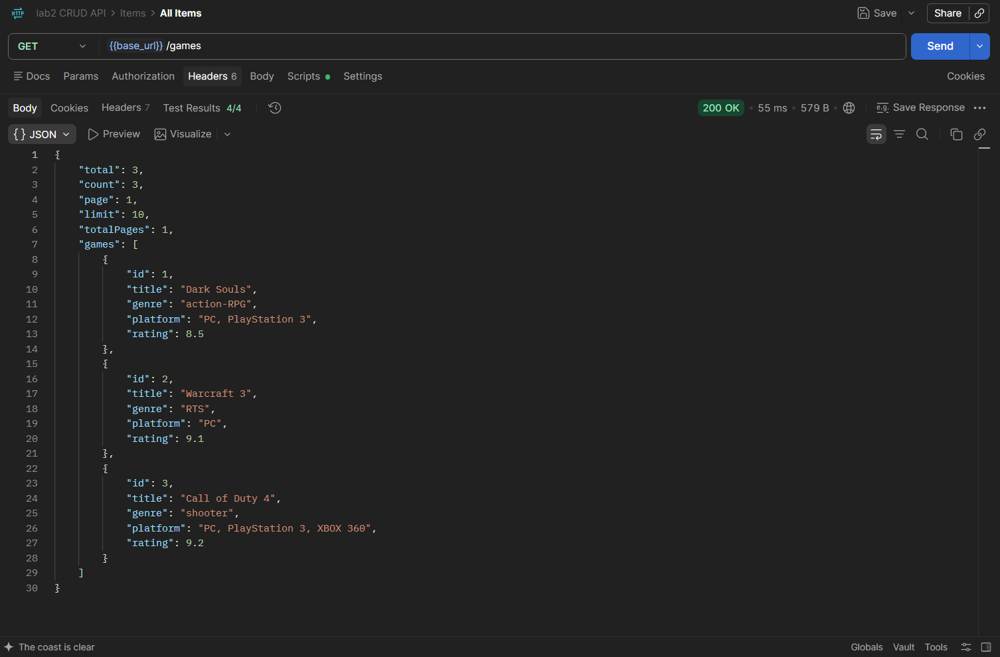
*Эндпоинт GET (базовый уровень)*

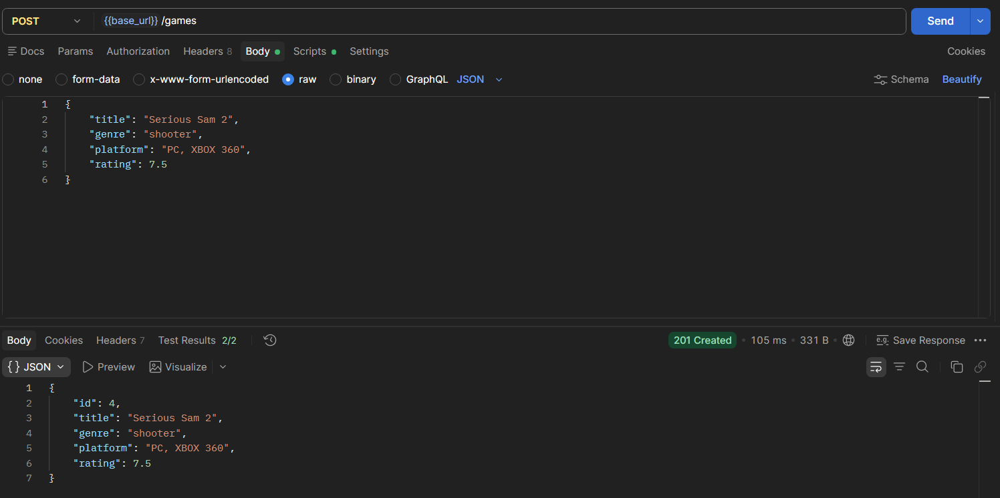
*Эндпоинт POST (базовый уровень)*

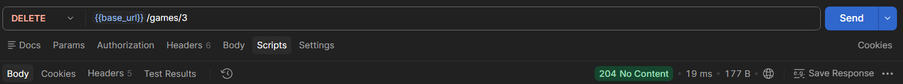
*Эндпоинт GET (базовый уровень)*

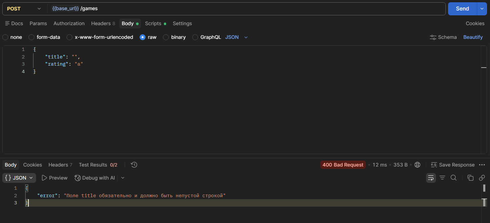
*Недопустимые поля в теле запроса (средний уровень)*

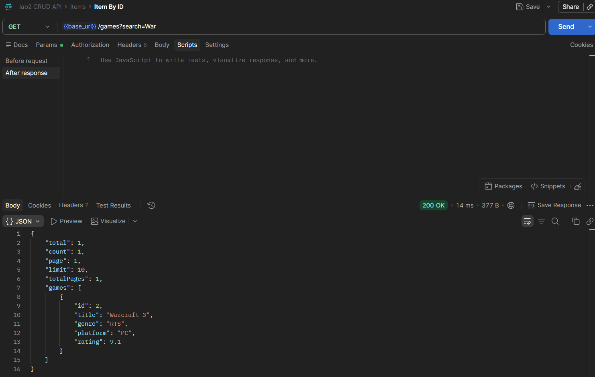
*Поиск по title (средний уровень)*

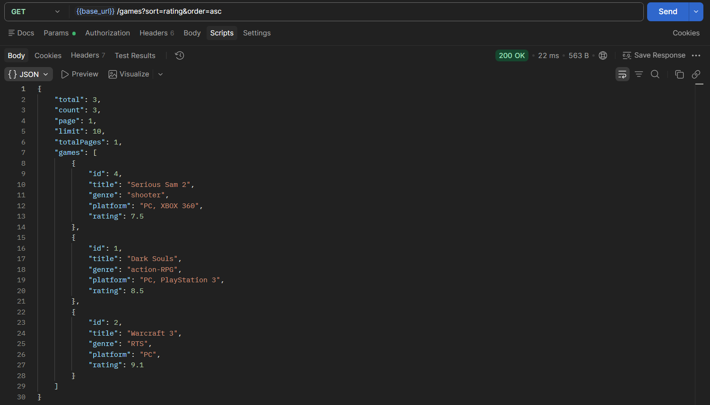
*Сортировка по rating (средний уровень)*

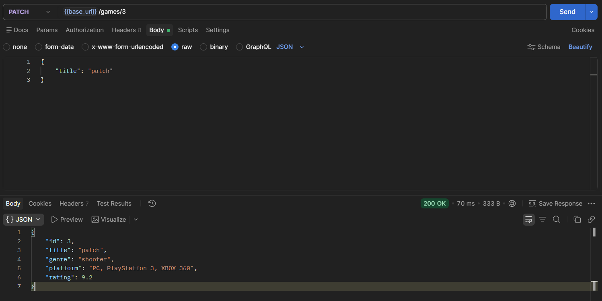
*Эндпоинт PATCH (продвинутый уровень)*

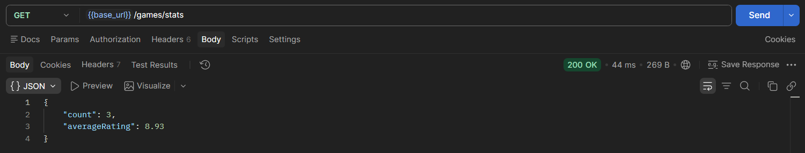
*Статистика (продвинутый уровень)*

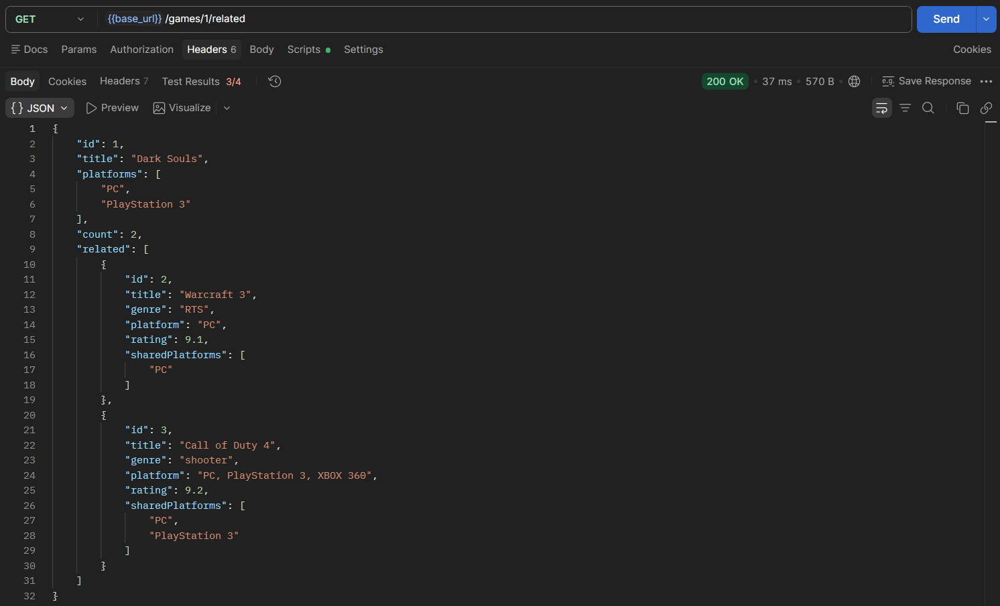
*Объекты с совпадающими значениями поля (продвинутый уровень)*

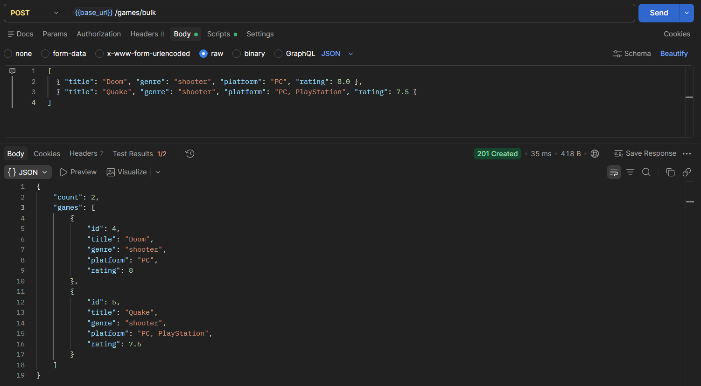
*Создание нескольких элементов (продвинутый уровень)*

## Ответы на вопросы

### Базовый уровень 
1. Что такое CRUD? Расшифруйте каждую букву. 
**Ответ**: CRUD — четыре основные операции работы с данными в HTTP: C - Create, R - Read, U - Update, D - Delete.
2. Какие HTTP-методы соответствуют операциям CRUD? 
**Ответ**: Create - POST, Read - GET, Update - PUT, PATCH, Delete - DELETE.
3. Что такое идемпотентность HTTP-методов? Какие методы идемпотентны? 
**Ответ**: идемпотентность - свойство методов HTTP, по которому повторное выполнение одного и того же запроса должно иметь тот же конечный эффект на сервере, что и однократное выполнение. Такими являются GET, DELETE, PUT и другие.
4. Какой код ответа возвращается при успешном создании ресурса (POST)? 
**Ответ**: 201 Created.
5. Какой код ответа возвращается при успешном удалении ресурса? 
**Ответ**: 204 No Content.
6. Что такое middleware в Express? Для чего используется express.json()? 
**Ответ**: middleware - функция, которая выполняется между получением запроса и отправкой ответа. express.json() - встроенный middleware, который позволяет Express получать и разбирать JSON из тела запроса.
7. Как получить параметры из тела POST-запроса в Express? 
**Ответ**: через req.body.
8. Как получить параметр из URL (например, ID)? 
**Ответ**: через req.params.
9.  Как найти элемент в массиве по ID? 
**Ответ**: например, так: const user = users.find(user => user.id === id);
10. Какой код ответа возвращается, если ресурс не найден? 
**Ответ**: 404 Not Found.
11. Как отправить JSON-ответ в Express? 
**Ответ**: через res.json.
12. Как вернуть статус-код 201 в Express? 
**Ответ**: res.status(201).json({.....});
13. Что произойдёт с данными в памяти при перезапуске сервера? 
**Ответ**: они сбросятся.
14. Как добавить новый элемент в массив? 
**Ответ**: через метод push().
15. Как удалить элемент из массива? 
**Ответ**: например, создать новый с помощью метода filter() без удаляемого элемента: users = users.filter(user => user.id !== id);

### Средний уровень 
1. В чём разница между PUT и PATCH? 
**Ответ**: PUT используется для полного изменения ресурса, PATCH - для частичного изменения.
2. Как реализовать поиск по коллекции (query-параметр search)? 3. Как реализовать сортировку по полю? 4. Как реализовать пагинацию (постраничный вывод)? 
**Ответ**:
``` js
app.get('/games', (req, res) => {
    // Реализация дополнительных эндпоинтов для среднего уровня

    // query - часть URL после знака ?, в которой клиент передаёт
    // дополнительные параметры в виде пар ключ=значение.
    // Express разбирает эту строку и кладёт результат в req.query как обычный JS-объект.
    const { search, sort, order = 'asc' } = req.query;         

    // Валидация параметров
    const page = parsePositiveInt(req.query.page, DEFAULT_PAGE);
    if (page === null) {
        return res.status(400).json({ error: 'Параметр page должен быть положительным целым числом' });
    }
    
    const limit = parsePositiveInt(req.query.limit, DEFAULT_LIMIT);
    if (limit === null || limit > MAX_LIMIT) {
        return res.status(400).json({
            error: `Параметр limit должен быть целым числом от 1 до ${MAX_LIMIT}`
        });
    }
 
    // 1. Поиск по title 
    let result = [...games];                // копия, чтобы sort не менял исходный массив
 
    if (search !== undefined) {
        const query = search.trim().toLowerCase();
        if (query) {
            result = result.filter(game => game.title.toLowerCase().includes(query));
        }
    }
 
    // 2. Сортировка по рейтингу 
    if (sort !== undefined) {
        const direction = (order === 'desc') ? -1 : 1;
 
        result.sort((a, b) => {
            const x = a[sort];
            const y = b[sort];
 
            // Отсутствующие значения всегда в конце, независимо от направления
            if (x == null && y == null) return 0;
            if (x == null) return 1;
            if (y == null) return -1;
 
            if (typeof x === 'number' && typeof y === 'number') {
                return (x - y) * direction;
            }
            return String(x).localeCompare(String(y), 'ru') * direction;
        });
    }
 
    // 3. Пагинация (после поиска и сортировки)
    const total = result.length;
    const totalPages = Math.ceil(total / limit);
    const start = (page - 1) * limit;
    const paged = result.slice(start, start + limit);
 
    res.json({
        total: total,                       // всего элементов после фильтрации
        count: paged.length,                // элементов на текущей странице
        page: page,
        limit: limit,
        totalPages: totalPages,
        games: paged
    });
});
``` 

5. Как валидировать входные данные (например, что price — число)? 
**Ответ**: 
``` js
if (typeof rating !== "number" || !Number.isFinite(rating)) {
    return res.status(400).json({
        error: "Поле rating обязательно и должно быть числом"
    });
}
```
6. Какие коды ответов используются при ошибках валидации? 
**Ответ**: 400 Bad Request, 404 Not Found.
7. Как вернуть 204 No Content при DELETE? 
**Ответ**: res.sendStatus(204).
8. В чём разница между res.json() и res.send()? 
**Ответ**: res.json() возвращает данные в формате JSON, в то время как res.send() может возвращать данные разного типа.
9. Как избежать дублирования ID при создании новых элементов? 
**Ответ**: создать константу, содержащую значение последнего ID, и при каждом создании элемента повышать её на единицу через преинкремент.
10.  Что такое express.json() и почему без него req.body пустой? 
**Ответ**: express.json() - middleware для разбора JSON-тела HTTP-запроса, без которой Express не будет автоматически преобразовывать JSON.

### Продвинутый уровень 
1. Как реализовать частичное обновление (PATCH)? 
**Ответ**: 
``` js
const FIELD_VALIDATORS = {
    title:    { check: v => typeof v === 'string' && v.trim() !== '',      message: 'title должен быть непустой строкой' },
    genre:    { check: v => typeof v === 'string',                         message: 'genre должен быть строкой' },
    platform: { check: v => typeof v === 'string',                         message: 'platform должен быть строкой' },
    rating:   { check: v => typeof v === 'number' && Number.isFinite(v),   message: 'rating должен быть числом' }
};

// Проверка на простой объект (не нулевой, является объектом и не является массивом)
const isPlainObject = v => v !== null && typeof v === 'object' && !Array.isArray(v);

app.patch('/games/:id', (req, res) => {
    const id = parseInt(req.params.id);
    const index = games.findIndex(i => i.id === id);
 
    if (index === -1) {
        return res.status(404).json({ error: 'Элемент не найден' });
    }
 
    const body = req.body;
 
    if (!isPlainObject(body)) {
        return res.status(400).json({ error: 'Тело запроса должно быть JSON-объектом' });
    }
 
    const updates = {};
    for (const field of Object.keys(FIELD_VALIDATORS)) {                                        // возвращает массив ключей объекта                
        if (body[field] !== undefined) {
            updates[field] = body[field];
        }
    }
 
    if (Object.keys(updates).length === 0) {
        return res.status(400).json({
            error: 'Не передано ни одного поля для обновления'
        });
    }
 
    const errors = validateFields(updates);
    if (errors.length > 0) {
        return res.status(400).json({ error: 'Некорректные данные', details: errors });
    }
 
    // Перезапись только переданных полей
    Object.assign(games[index], updates);                                                       // перезапись существующих полей
 
    res.json(games[index]);
});
```
2. Как реализовать массовое удаление элементов? 
**Ответ**: с помощью вызова метода DELETE и полной очистки массива.
3. Как реализовать массовое создание элементов? 
**Ответ**: с помощью метода POST, проверки того, является ли массивом отправленный ответ, создания новых объектов и их пуша в исходный массив.
4. Как реализовать глобальный обработчик ошибок? 
**Ответ**: через обработку сначала ошибок со стороны клиента (4xx), затем ошибок сервера (5xx).
5. Как логировать запросы в файл? 
**Ответ**: 
``` js
const fs = require('fs');
const path = require('path');
const express = require('express');

const app = express();
const logStream = fs.createWriteStream(path.join(__dirname, 'requests.log'), { flags: 'a' });

app.use((req, res, next) => {
    const start = Date.now();

    res.on('finish', () => {
        const line = `${new Date().toISOString()} ${req.method} ${req.originalUrl} ${res.statusCode} ${Date.now() - start}ms ${req.ip}\n`;
        logStream.write(line);
    });

    next();
});

app.get('/', (req, res) => res.send('ok'));
app.listen(3000);
```
6. Что такое REST API и какие принципы лежат в его основе? 
**Ответ**: REST (Representational State Transfer) - это архитектурный стиль для веб-API, где всё строится вокруг ресурсов (пользователи, задачи, игры), доступных по URL, а действия над ними выражаются через HTTP-методы.
7. Как организовать структуру проекта для масштабируемого CRUD API? 
**Ответ**: разделить код по слоям ответственности, чтобы маршрутизация, логика и работа с данными не смешивались.
8. Какие существуют стратегии генерации уникальных ID? 
**Ответ**: ручной счётчик, автоинкремент, NanoID, UUID.
9. Как защитить API от слишком больших запросов? 
**Ответ**: ограничить размер тела запроса, ограничить частоту запросов, установить предельный объём данных в -байтах (битах).
10. Как реализовать связь между сущностями (например, задачи и пользователи)? 
**Ответ**: через базы данных, проектирование URL в REST.

## Выводы
В результате выполнения работы был получен базовый теоретический материал, связанный с бэкенд-разработкой, и освоены способы обработки различных HTTP-методов (GET, POST, PUT, DELETE) в Express, полученые навыки реализации CRUD-операций над коллекцией объектов, хранящейся в памяти сервера, а также возврата HTTP-кодов ответов (200, 201, 404).

## Список использованной литературы
1. Express - Routing - https://expressjs.com/en/guide/routing.html 
2. Express - Request и Response - https://expressjs.com/en/4x/api.html 
3. HTTP-методы (MDN) - https://developer.mozilla.org/ru/docs/Web/HTTP/Methods 
4. Коды состояния HTTP (MDN)  - https://developer.mozilla.org/ru/docs/Web/HTTP/Status 
5. REST API Tutorial - https://restfulapi.net/ 
6. Postman Learning Center - https://learning.postman.com/ 
7. Thunder Client - https://www.thunderclient.com/